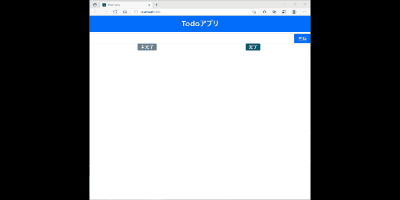

# React_first_Sample
This app is created for to understand how to create Todo app.
## Function

## Setting
Preparation
```bash
git clone https://github.com/teslasand0987/React_first_Sample.git
cd React_first_Sample
npm install
npm install react-bootstrap bootstrap
```
Start
```bash
npm start
```

## local server start
Server started: http://localhost:3000/
